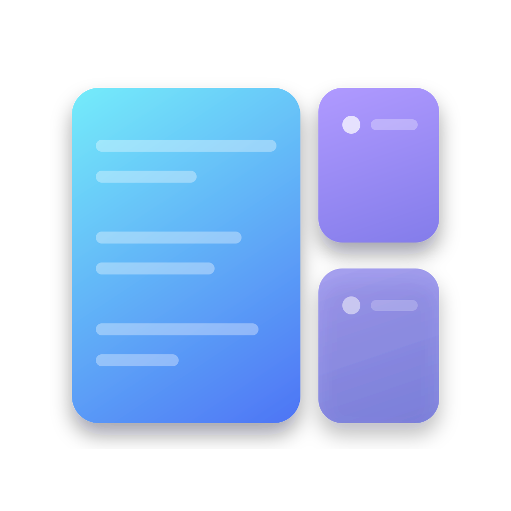
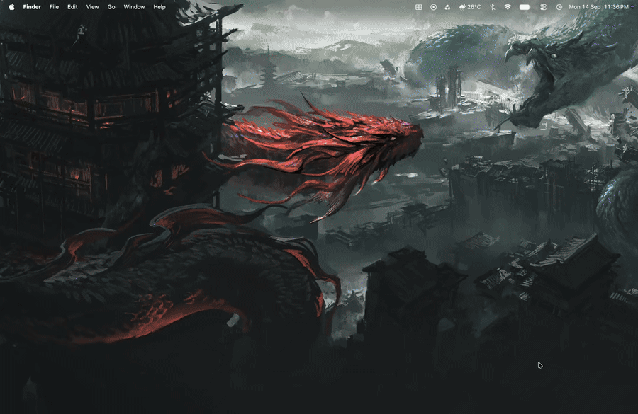

<p align="center">
  
</p>

<h1 align="center">minimalWM</h1>

<p align="center">A focused, smooth master-stack tiling window manager for macOS.</p>

<p align="center">
  
</p>

[](./LICENSE)
[](https://www.apple.com/macos/)
[](https://www.swift.org/)

minimalWM is a lightweight, native macOS tiling window manager with configurable gaps, smooth spring rearrangements, and a predictable master-stack layout. It runs locally as a menu bar app and uses macOS Accessibility APIs — no account, daemon, or network service required.

The app icon uses transparent layered color panes so macOS can apply light, dark, and tinted treatments without a baked-in square background.

## Highlights

- Native Swift executable for macOS
- Master-stack layout with a configurable master ratio
- Independent inner and outer gaps
- Per-display logical ordering that is not derived from window coordinates
- New windows become master; existing windows cycle down the stack
- Spring-based drag previews and smooth resize transitions
- Manual drag placement persists until you change the order again
- Menu bar controls for toggling, gaps, master width, and shortcuts
- Floating-app exclusions and native multi-display support

## Install

### Requirements

- macOS 14.0 or later
- Apple Silicon or Intel Mac; release artifacts are universal
- Swift 6.0 toolchain

### Homebrew (recommended)

Once the personal tap is published:

```bash
brew tap looph0le/tap
brew install --cask minimalwm
open -a minimalWM
```

The cask installs a universal macOS app bundle with a native `.icns` icon. On first launch, grant **Accessibility** permission in **System Settings → Privacy & Security → Accessibility**.

### Build and install

```bash
git clone https://github.com/looph0le/minimalWM.git
cd minimalWM
./install.sh
```

The installer builds a universal release app, installs it to `/Applications/minimalWM.app`, and creates a LaunchAgent so it can start automatically. If `/Applications` is not writable, run the install command with the permissions appropriate for your machine.

### Accessibility permission

On first launch, open **System Settings → Privacy & Security → Accessibility** and enable `minimalWM`. The permission is required because the window manager reads and updates other applications' window frames.

## Run

```bash
minimalWM
```

To start or stop the installed LaunchAgent manually:

```bash
launchctl load "$HOME/Library/LaunchAgents/com.minimalWM.plist"
launchctl unload "$HOME/Library/LaunchAgents/com.minimalWM.plist"
```

To remove the installed files:

```bash
rm -rf /Applications/minimalWM.app
rm "$HOME/Library/LaunchAgents/com.minimalWM.plist"
```

To remove the Homebrew installation:

```bash
brew uninstall --cask minimalwm
brew untap looph0le/tap
```

## Layout

```
┌──────────────────┬──────────┐
│                  │          │
│     MASTER       │  STACK   │
│  (code editor)   │ (term,   │
│                  │  docs)   │
│                  │          │
│                  ├──────────┤
│                  │  STACK   │
│                  │ (browser)│
└──────────────────┴──────────┘
```

- One master window on the left (~55% width, configurable)
- Remaining windows split the right column equally
- Gaps between all windows and around screen edges
- New windows become the master on the display where they appear; existing windows cycle down the stack

The manager tiles macOS windows, not browser tabs. A new Safari or Ghostty tab changes the existing window's title but does not create another tiled window; opening a separate window does.

## Hotkeys

| Key | Action |
|-----|--------|
| `⌘⌃ Space` | Toggle tiling on/off |
| `⌘⌃ H / L` | Focus left / right |
| `⌘⌃⇧ H / L` | Swap window left / right |
| `⌘⌃ J / K` | Shrink / grow master area |
| `⌘⌃ F` | Toggle float on focused window |

## Configuration

Config file: `~/.config/minimalWM/config.json`

```json
{
  "outer_gap": 10,
  "inner_gap": 8,
  "sync_gaps": false,
  "master_ratio": 0.55,
  "toggle_key": "cmd+ctrl+space",
  "float_apps": [
    "System Settings",
    "Calculator"
  ]
}
```

| Key | Default | Description |
|-----|---------|-------------|
| `outer_gap` | `10` | Space between windows and screen edges (px) |
| `inner_gap` | `8` | Space between adjacent windows (px) |
| `sync_gaps` | `false` | Keep outer and inner gaps equal; editing either gap disables sync |
| `master_ratio` | `0.55` | Master window width as fraction of available space (0.25–0.75) |
| `float_apps` | `[]` | App names to exclude from tiling |

Changes are applied immediately when saved.

## Troubleshooting

### Windows are not tiling

Confirm that `minimalWM` is enabled under **System Settings → Privacy & Security → Accessibility**, then toggle tiling with `⌘⌃ Space`. Apps listed in `float_apps` are intentionally excluded.

### A window is floating during a drag

The window under the pointer remains under user control while dragging. Other windows preview the destination, and the dragged window is placed only after the mouse button is released.

### Safari tabs are not rearranging independently

macOS Accessibility exposes Safari windows rather than individual tabs. Create a new Safari window if you want another tiled item.

### Reset the configuration

```bash
rm "$HOME/.config/minimalWM/config.json"
```

The default configuration is recreated on the next launch.

## Menu Bar

Click the tiling icon in your menu bar to:
- Toggle tiling on/off
- Adjust master width, outer gap, and inner gap with sliders
- See hotkey reference
- Quit

## How It Works

- Uses the macOS Accessibility API (AXUIElement) to read and set window positions
- Observes window events (create, move, resize, close) via AXObserver to re-tile automatically
- Polls Accessibility window topology twice per second as a fallback for missed events
- Respects macOS native workspaces — tiles per-display, per-space
- Maintains a separate logical master-stack order for each display instead of deriving order from current window coordinates
- Handles Chromium/Electron apps via the AXEnhancedUserInterface workaround
- Drag previews use directional slot boundaries with a small hysteresis band to avoid order flicker
- The dragged window is left under user control until release; empty-space drops restore the prior order

### Development

```bash
./dev.sh --once
```

`dev.sh` optionally uses a local codesigning identity named `MinimalWM Developer` to preserve Accessibility trust across rebuilds. This identity is not included with the project and is not required for release builds.

For a release-style local run without installing the LaunchAgent:

```bash
./Packaging/package-app.sh
open dist/minimalWM.app
```

`Packaging/package-app.sh` builds arm64 and x86_64 binaries, combines them into one universal executable, generates the macOS icon family, and creates `dist/minimalWM-universal.zip` for GitHub Releases.

## Contributing

Issues and pull requests are welcome. Please include the macOS version, hardware architecture, Swift version, and relevant debug output when reporting a problem. Never include credentials, private keys, or personal configuration files in an issue or pull request.

## Requirements

- macOS 14.0+
- Swift 6.0+

## License

MIT
